# Consul

**Set the mandate. Consul sees it through.**

<p align="center">
  
</p>

Describe an app in plain words. Consul turns it into a plan you approve, then builds it, tests it, and puts it online with Claude Code, on your own GitHub and Render accounts. Claude Code is the only thing you install. Everything else is set up for you, and nothing runs anywhere you don't own.

[Landing page](https://nbdesai1992.github.io/consul/) · [Getting started, click by click](GETTING-STARTED.md) · [Developer setup](SETUP.md)

## Three steps

### 1. Start

```bash
git clone https://github.com/nbdesai1992/consul.git ~/consul
cd ~/consul && claude
```

Then type `/start`. Claude checks your Mac and installs what's missing, walks you through GitHub and Render one step at a time, and asks four questions: the app's name, what it does, who it's for, and whether people sign in. It asks before spending money, then creates everything.

You end up with a private GitHub repo, a database and two web services running on Render with a starter page, and Claude Code set up inside the project. About 20 minutes the first time, mostly account setup. About 5 minutes for every project after that.

### 2. Set the mandate

Open the new project and describe the app.

```
cd ~/code/your-app && claude
/spec create "an invoice tracker for freelancers"
```

Claude asks a few questions, then writes a brief: numbered requirements, each with how you'll know it works. You approve it, and Claude hands you one `/goal` line.

**What fits.** A web app with a database and screens people use.

| You say | The brief covers | You get |
|---|---|---|
| An invoice tracker for freelancers | Invoices with line items, status, who owes what | A working app with its data in your database |
| A booking page for a yoga studio | Classes, spots left, sign-ups | A public page plus the admin screens behind it |
| An internal dashboard for support tickets | The fields, the filters, the charts | A private tool wired to its own API |

### 3. Let it work

Paste the `/goal` line and walk away. It works until the brief is done or needs you. Each turn, Consul picks the next piece of work and hands it to a specialist.

- **Infrastructure first.** The database and services are checked against `render.yaml` before any code is written.
- **Backend, tested for real.** API and data code, with tests that run against the real Render database.
- **Frontend, designed for your world.** Screens styled for the product's domain and checked by screenshot, locally and live.
- **Deploys.** In Quick Start, Consul pushes and confirms the new version is live. In Custom, you can keep that step for yourself.

After every turn a separate checker asks one question: is the brief done, or truly waiting on you? If neither, the next turn starts. Close the window any time. `/orchestrate` picks up where the brief says.

Your plan is a card on a board in `briefs/`, and its folder is its status.

| Folder | Meaning | You |
|---|---|---|
| `1-backlog/` | Written and approved, not started | Nothing yet |
| `2-active/` | Being built | `/status` shows progress |
| `3-blocked/` | Needs you, with the questions and options written out | Answer in the chat, then `/orchestrate` |
| `4-done/` | Every requirement checked, with evidence | Open the live address |

> **Done means checked.** A brief reaches `4-done/` only when every requirement has evidence behind it, and a brief that needs you is never reported as finished. Hooks enforce this, so it holds even when a model forgets.

<!-- REAL-RUN -->

## Set up once (about 20 minutes)

You need a Mac, [Claude Code](https://claude.ai/code) signed in, and a card for Render. `/start` does the rest.

1. **Tools.** Installs the GitHub CLI, Node, and the screenshot tool if they're missing. No Homebrew needed.
2. **GitHub.** Walks you through `gh auth login` in the browser.
3. **Render.** Account, payment method, Render reading your GitHub, and an API key, which is stored once on your Mac for every project.
4. **Sign-in (optional).** If your app needs accounts, a free [Clerk](https://clerk.com) app and its two keys.

**Done.** Try step 2 above. The same steps, click by click, are in [GETTING-STARTED.md](GETTING-STARTED.md).

## Cost

Consul is free and open source. Your app runs on Render, billed by Render: two starter services at about $7 a month each and a small database at about $6, so roughly **$20 a month per project** while it exists. Deleting the project stops the charge. Claude Code usage comes from your Claude plan.

## When something goes wrong

Inside a project, `/preflight` checks everything and prints PASS, WARN, or FAIL with a fix for each FAIL. The common cases are below.

| What you see | What it means | Fix |
|---|---|---|
| Provisioning fails with 402 or 403 | No payment method on Render | Render → Billing → add a card, then `python3 .claude/scripts/provision.py` |
| Provisioning says Render can't read the repo | Render isn't connected to your GitHub | Render → Account Settings → GitHub → allow **All repositories** |
| A 401 or "key rejected" from Render | The API key was deleted or mistyped | Create a new key, then `python3 ~/consul/onboard.py --set-render-key` |
| A headless `claude -p` run skips the guardrails | The project folder was never trusted, so hooks don't load | Open `claude` in the project once and accept the trust prompt |
| The brief moved to `3-blocked/` | It needs a decision or an action from you | Answer the questions in the chat, then `/orchestrate` |

`/start` is always safe to run again.

## Delete a project

```bash
cd ~/code/your-app
python3 .claude/scripts/provision.py --destroy --delete-repo
```

It lists what it will delete, asks you to type the project's name, then removes the services and database on Render and the repository on GitHub. Billing stops. Leave off `--delete-repo` to keep the code.

## Commands

| Command | What it does |
|---|---|
| `/start` | In the Consul folder: set up your accounts and create a new project |
| `/spec create "…"` | Interview, then a brief in `1-backlog/` and its `/goal` line |
| `/spec update <id>` | Change a brief's requirements; an active brief re-plans next turn |
| `/spec show` | The board, or one brief in detail |
| `/goal <line>` | Work the brief until it lands in `4-done/` or `3-blocked/` |
| `/orchestrate` | One turn by hand; also resumes a blocked brief after you answer |
| `/status` | Board summary; add `detail`, `blockers`, or `requirements` |
| `/preflight` | Readiness check for tools, GitHub, Render, services, and secrets |

## What's inside

A new project gets nine skills, three specialists, and the guardrails around them.

| Piece | What it does |
|---|---|
| `orchestrate` | The runner. Picks the brief, splits it into subtasks, hands each to a specialist, checks the evidence, routes to done or blocked |
| `spec` | Interviews you and writes the brief with its acceptance criteria and `/goal` line |
| `bold-design` | Keeps screens from looking generic: type, color, and details from the product's world |
| `verify-ui` | Screenshots the app and checks it against the brief, locally and live |
| `backend-test` | Tests against the real database. No mocks, no SQLite stand-ins |
| `deploy` | Render operations, API-first, with debugging playbooks |
| `worker-protocol` | Shared rules for specialists: scope, blockers, clean-up, a structured report |
| `status`, `preflight` | The board at a glance, and the readiness check |
| backend, frontend, infra workers | The specialists, each with its skills preloaded |
| Hooks | A brief must be updated every turn; every subagent call is logged; Render commands are locked to one workspace |

```
your-app/
├── backend/                # the API and data (FastAPI)
├── frontend/               # the screens (Next.js)
├── render.yaml             # the database and two services, described in one file
├── briefs/                 # the board: 1-backlog/ 2-active/ 3-blocked/ 4-done/
└── .claude/
    ├── skills/  agents/    # how to plan, build, check, and publish; the three specialists
    ├── hooks/              # brief-progress-guard, trajectory-log, render-workspace-guard
    └── scripts/            # provision.py (creates Render resources), preflight.py, render-api-key.sh
```

## Two modes

| | Quick Start (default) | Custom |
|---|---|---|
| Questions | Four, in plain words | Stack, auth, env group, who pushes |
| Stack | Next.js, FastAPI, PostgreSQL on Render | Your choice |
| Deploys | Consul pushes and verifies | You push, or Consul does |
| Tone | Plain language; decisions asked in chat | Developer detail |

Developers can skip `/start` and run the wizard directly. See [SETUP.md](SETUP.md).

## Updating a project

Pull the latest Consul, then re-apply it to a project.

```bash
cd ~/consul && git pull
python3 onboard.py ~/code/your-app --reconfigure
```

Skills, specialists, hooks, scripts, settings, and `CLAUDE.md` are refreshed from the saved config. The previous `CLAUDE.md` is kept in `session/`. Your code, `render.yaml`, briefs, and secrets stay as they are.

## Development

- `python3 -m unittest discover -s tests` runs the offline wizard tests. They create real projects in a temp folder with no GitHub or Render calls.
- [CLAUDE.md](CLAUDE.md) holds the contract and the rules for changing Consul. [docs/decisions.md](docs/decisions.md) holds the reasons.
- Consul was called Shipwright, and before that Software Factory. Projects set up under those names keep working.

## Roadmap

- Claude Code's built-in browser in place of the `dev-browser` screenshot tool.
- More clouds, starting with AWS.
- Independent subtasks in parallel.

## Family

Consul has two siblings for Claude Code: [Overtone](https://github.com/nbdesai1992/overtone), for talking to it, and [Relay](https://github.com/nbdesai1992/relay), for handing it tasks from Todoist.

## License

[MIT](LICENSE)
